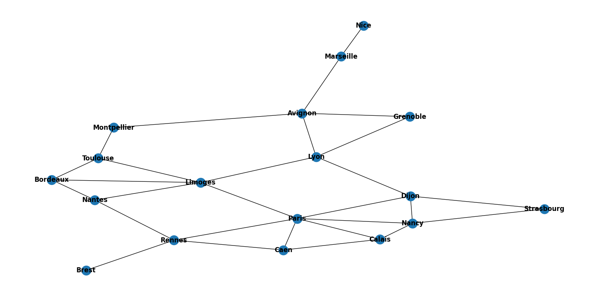

# Graph Traversal Using NetworkX (Shortest Path)

## Introduction
This project demonstrates graph traversal techniques, focusing on finding the shortest path using the NetworkX library in Python. Graph traversal is an essential concept in computer science, enabling the exploration of nodes and edges in various types of graphs, such as social networks, road maps, or web structures.

Navigate to the GraphTraverse.ipynb Jupyter notebook to explore the implementation. You can also download and run the corresponding Python script locally for further exploration and modification.



## Graph Traversal Techniques
This project specifically covers the following traversal methods:
- **Breadth-First Search (BFS):** A level-order traversal that explores all the neighbors of a node before moving to the next level.
- **Depth-First Search (DFS):** An exploration strategy that goes deep into the graph before backtracking.
- **Dijkstra’s Algorithm:** A popular algorithm for finding the shortest path from a source node to all other nodes in a weighted graph.

## Use Cases

### 1. **Social Networks**
Graph traversal algorithms like BFS and DFS can help find the shortest connection between people in a social network. For example, you can use Dijkstra’s Algorithm to find the shortest path between two users based on the number of shared connections or interactions.

### 2. **Navigation Systems**
Navigation applications often use graph traversal to find the shortest route between two locations on a map. Dijkstra’s Algorithm and A* search are frequently used for finding optimal paths in road networks.

### 3. **Web Crawling**
Graph traversal is used in web crawlers to explore websites by following links between web pages, identifying important hubs and authorities, and ranking pages based on connectivity.

### 4. **Recommendation Systems**
By modeling users and items as a graph, traversal can be used to recommend new items to users by exploring the shortest paths or connections between them and other users with similar preferences.

### 5. **Network Routing**
Graph traversal algorithms are integral to finding efficient routes for data packets in a network, ensuring minimal latency and optimal performance.

## Technology

This project utilizes a variety of technologies, including:

- **Python:** The core programming language used for implementing graph traversal algorithms.
- **NetworkX:** A Python package for the creation, manipulation, and study of complex networks and graphs.
- **Jupyter Notebook:** An interactive environment to visualize and run the graph algorithms step by step.
- **Matplotlib & Seaborn:** Used for visualizing graph structures and data in the notebook.
- **Data Structures:** Graphs are represented using adjacency lists and matrices.
- **Machine Learning (Optional):** Integrating graph traversal in machine learning models, such as node embeddings for link prediction.

## How to Run

1. Clone this repository:
   ```bash
   git clone https://github.com/yourusername/graph-traverse.git
   ```

2. Navigate to the project folder:
   ```bash
   cd graph-traverse
   ```

3. Install the required dependencies:
   ```bash
   pip install -r requirements.txt
   ```

4. Run the Jupyter notebook:
   ```bash
   jupyter notebook GraphTraverse.ipynb
   ```

Alternatively, you can run the `.py` script:
```bash
python graph_traverse.py
```

## Conclusion

This project showcases how graph traversal algorithms can be applied to various real-world problems. From shortest path calculations to recommendation systems, graph-based solutions are integral to solving complex, networked problems efficiently.
